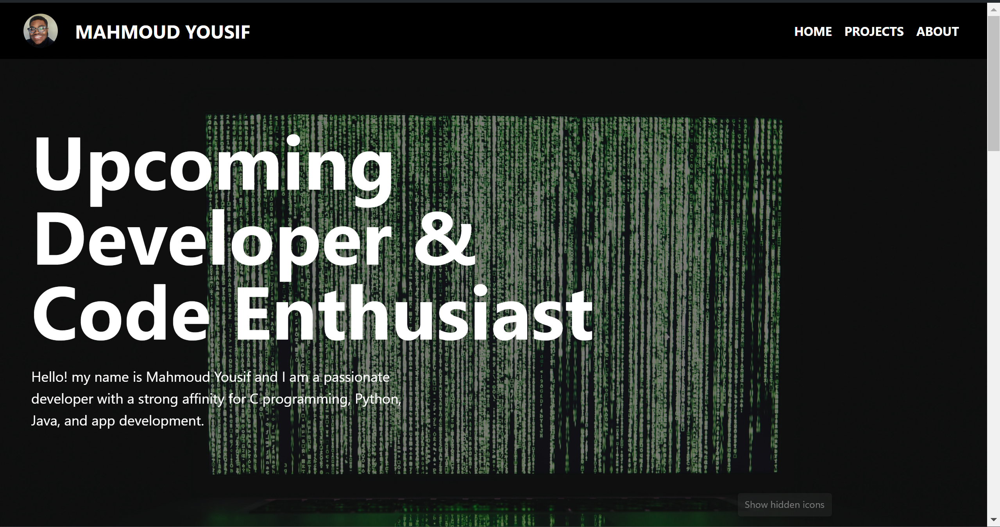

# React Portfolio with Vite

This project demonstrates a portfolio website built using React and Vite. It incorporates modern web technologies such as Tailwind CSS for styling and React Icons for scalable graphics. Below is a guide to setting up the project, running it locally, and understanding its structure.

## Project Demo



## Installation

Ensure you have the following installed:
- Node.js
- npm (Node Package Manager)


Install the necessary packages to get started with the project:

1. **React Icons** - Adds scalable icons to your React applications:
   ```
   npm install react-icons --save
   ```

2. **React DOM** - Manages DOM operations in your React applications:
   ```
   npm install react-dom --save
   ```

3. **Tailwind CSS** - A utility-first CSS framework for rapid UI development:
   - Install Tailwind CSS and its dependencies:
     ```
     npm install -D tailwindcss postcss autoprefixer
     ```
   - Generate Tailwind CSS configuration files:
     ```
     npx tailwindcss init -p
     ```

## Running Locally

To run the project locally after installation:
1. Navigate to your project directory in the command line.
2. Start the development server:
   ```
   npm run dev
   ```
3. Open your browser and visit `http://localhost:3000` to view the application.

## Components Overview

### `About.jsx`

This component displays information about the individual or entity the portfolio is representing. It typically includes a brief biography and any relevant personal or professional details.

### `Footer.jsx`

Displays footer information, including copyright notices and links to other important sections of the portfolio.

### `Homescreen.jsx`

Serves as the landing page of the portfolio, often featuring a greeting, a brief introduction, and navigation links to other sections of the site.

### `Projects.jsx`

Showcases projects or works. It may include images, descriptions, and links to live projects or case studies.

### `Topnav.jsx`

Provides navigation across the portfolio, ensuring users can easily find and access various sections of the website.

## Further Help

For additional help, consult the [React documentation](https://reactjs.org/) and the [Tailwind CSS documentation](https://tailwindcss.com/docs).
